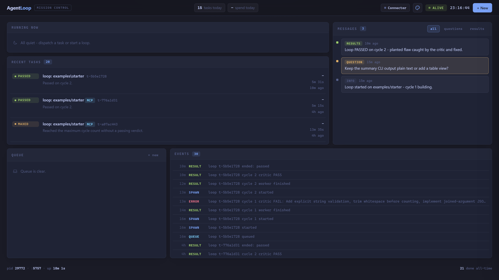

# AgentLoop

Self-improving fresh-context loops for coding work you can watch.



[Watch the demo](https://youtu.be/4zRdMMzh3C8) | [Try the replay](https://agentloop-replay.vercel.app) - a real recorded run in the live dashboard

## What it is

Plan a goal in ChatGPT, then let it rip. AgentLoop is a local orchestration daemon for coding agents: each cycle starts a fresh worker, work carries forward in project files, a fresh critic enforces your rubric, and the whole run is watchable on a local dashboard.

It exists because running coding agents by hand means shuttling plans between a chat and a terminal all day, and quality slips the moment you stop watching.

Your standards live in GUIDELINES.md and the critic enforces them every cycle, so you supervise the work without babysitting it.

## Why sequential fresh-context

Long-running chats collect stale assumptions and irrelevant context. That is context rot. AgentLoop starts a new `codex exec` process for every worker and critic session, so no prior chat history follows them. The durable context is the project itself plus concrete critic fixes. That keeps a loop bounded, easier to leave unattended, and less likely to spend tokens re-reading an ever-growing conversation.

A loop is intentionally sequential. Independent queued tasks can run up to `maxConcurrent`, but one loop does not create a parallel swarm that races across the same project.

```text
ChatGPT -> MCP bridge -> daemon -> worker/critic cycles -> dashboard
```

## How it works

- **Dispatch** sends one one-shot task to `POST /api/dispatch`. Its file moves from pending to running to done, with a transcript and dashboard cancellation.
- **Loop** runs a project cycle by cycle. A worker reads `PLAN.md` and `STATE.md`, makes one increment, updates state, and exits. A fresh critic then reads `PLAN.md`, `GUIDELINES.md`, the worker output, and the project files. The next worker is a new process.
- **Polish mode** is an optional loop flag: after the first PASS, remaining cycles become polish cycles where the critic re-verifies the guidelines and proposes one improvement per cycle until it verdicts SHIP.
- **Critic contract** requires the final line to be exactly `VERDICT: PASS` or `VERDICT: FAIL - <concrete fixes>`. FAIL becomes injected fix notes for the next worker; PASS ends the loop unless polish mode is on. Polish cycles end with `VERDICT: IMPROVE - <one improvement>` or `VERDICT: SHIP`. `maxCycles` is capped at 1 to 10 and defaults to 3.
- **Files are memory.** `PLAN.md`, `STATE.md`, and `GUIDELINES.md` carry the goal, progress, and rubric. A loop project needs `PLAN.md`; missing `STATE.md` and `GUIDELINES.md` files are seeded automatically.
- **Messages narrate a run.** A connected chat client can post `info`, `question`, or `results` messages through the bridge. They appear in the dashboard Messages panel.

The daemon is plain Node with no package dependencies. Task state, results, transcripts, events, and messages are stored as JSON or NDJSON files. The dashboard is one local HTML file at `http://127.0.0.1:5757`.

## Built with Codex

The daemon, filesystem store, loop engine, critic, bridge, and dashboard wiring were built in Codex CLI sessions with GPT-5.6. The workflow was plan in ChatGPT, execute in Codex sessions, review rounds with automated reviewers, then forward-fix commits.

AgentLoop then runs Codex CLI as both its worker and critic engine. Codex built a tool that drives Codex.

## Quickstart

Requirements:

- Node.js 18 or newer
- Git
- Codex CLI installed and authenticated, with `codex` available on `PATH`

Windows:

```powershell
git clone https://github.com/aiedwardyi/AgentLoop.git
cd AgentLoop
node src\daemon.js
```

Open `http://127.0.0.1:5757`. Select **+ New**, enter a title and prompt, then select **Dispatch task**. No dependency install is required.

## Connect ChatGPT

This is optional: once connected, you can plan and launch real work on your machine from a chat, without opening a terminal.

1. In the dashboard, open **Connector** and select **Start**.
2. Expose the local bridge on port 5758. For example:

```powershell
cloudflared tunnel --url http://127.0.0.1:5758
```

3. Copy the authenticated connector URL from the Connector popover. Replace the local host with your tunnel host while preserving `/mcp?key=...`.

```text
https://<your-tunnel-host>/mcp?key=<token-from-Connector>
```

Treat this URL as a secret; the token persists in state/mcp-token - delete that file and restart the bridge to rotate it.

4. Add that URL as a ChatGPT custom connector, then describe tasks in plain English.

The bridge listens only on `127.0.0.1:5758`, uses a token, and exposes `agentloop_status`, `dispatch_task`, `start_loop`, and `send_message`.

## Try the demo loop

With the daemon running, select **+ New** and use the Loop form:

- **Project:** `examples/starter`
- **Max cycles:** `3`
- Select **Start loop**

Cycle 1 deliberately implements only the normal input path. The critic reads `GUIDELINES.md`, rejects the missing hardening and command-line requirements, and emits a FAIL verdict. Cycle 2 receives those fixes, completes the utility, and should PASS.

Watch cycle progress in **Running now** and critic verdicts in **Events**. Open the completed task to see its transcript. Messages posted through the bridge appear in **Messages**.

## Configuration

`config.json` contains the local runtime settings:

| Key | Default | Purpose |
| --- | --- | --- |
| `dashboardPort` | `5757` | Local dashboard port. |
| `maxConcurrent` | `2` | Maximum concurrent queued tasks or loops. |
| `taskTimeoutMin` | `45` | Timeout in minutes for each worker or critic session. |
| `defaultEngine` | `codex` | Default loop engine. This release accepts `codex` only. |
| `mcpBridge.port` | `5758` | Local MCP bridge port. |
| `model` | `gpt-5.6-terra` when unset | Optional default model for workers and critics. |

The shipped `config.json` includes every key above except the optional `model` key.

## Supported platforms

Windows is the primary path:

```powershell
node src\daemon.js
```

macOS and Linux use the equivalent command:

```bash
node src/daemon.js
```

On every platform, install and authenticate Codex CLI first. The daemon and bridge bind to loopback addresses, so a tunnel is required for a hosted connector.

## Roadmap

- **Research loops.** Cycles that gather sources first, then write against an explicit rubric - reports, docs, briefs.

- **Two-way messages.** The dashboard already receives questions from the chat client; answering from the panel closes the loop.

- **OS-level sandboxing.** Workers are prompt-confined today; a real sandbox hardens long unattended runs.

- **More engines.** The engine layer is pluggable by design. Codex ships first.

## License

MIT. See [LICENSE](LICENSE).
