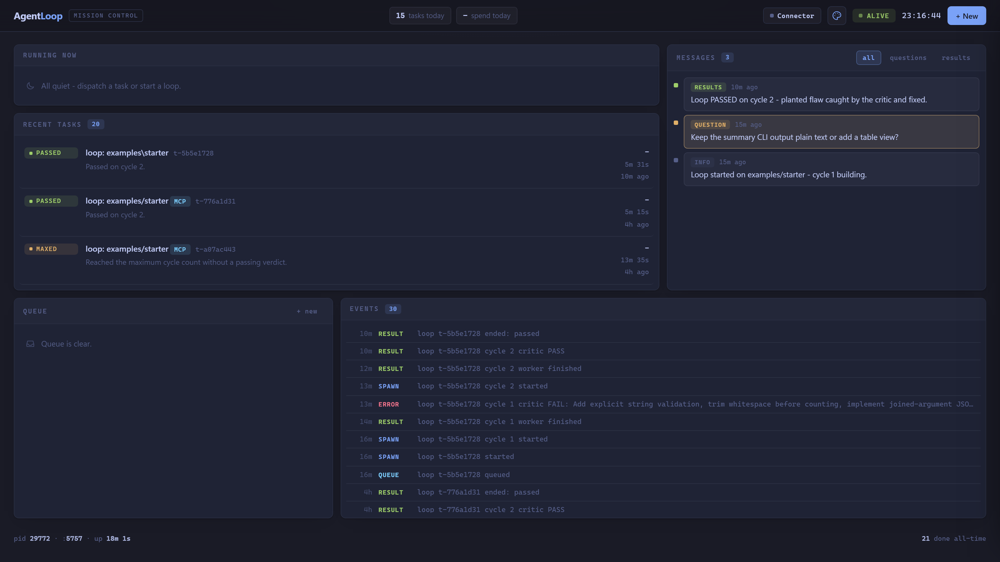

# AgentLoop

Self-improving fresh-context loops for coding work you can watch.



[Watch the demo](https://youtu.be/4zRdMMzh3C8) | [Try the replay](https://agentloop-replay.vercel.app) - a real recorded run in the live dashboard

## What it is

Plan a goal in Claude or ChatGPT, then let it rip. AgentLoop is a local orchestration daemon for coding agents: each cycle starts a fresh worker, work carries forward in project files, a fresh critic enforces your rubric, and the whole run is watchable on a local dashboard.

Codex CLI and Claude Code both run as engines. Pick one per loop from the dashboard, or per task through the bridge.

AgentLoop is for solo developers who run long agent tasks across multiple projects and cannot supervise every session.

It exists because running coding agents by hand means shuttling plans between a chat and a terminal all day, and quality slips the moment you stop watching.

Your standards live in GUIDELINES.md and the critic enforces them every cycle, so you supervise the work without babysitting it.

## Why sequential fresh-context

Long-running chats collect stale assumptions and irrelevant context. That is context rot. AgentLoop starts a new engine process for every worker and critic session, so no prior chat history follows them. The durable context is the project itself plus concrete critic fixes. That keeps a loop bounded, easier to leave unattended, and less likely to spend tokens re-reading an ever-growing conversation.

A loop is intentionally sequential. Independent queued tasks can run up to `maxConcurrent`, but one loop does not create a parallel swarm that races across the same project.

```text
Claude or ChatGPT -> MCP bridge -> daemon -> worker/critic cycles -> dashboard
```

## How it works

- **Dispatch** sends one one-shot task to `POST /api/dispatch`. Its file moves from pending to running to done, with a transcript and dashboard cancellation.
- **Loop** runs a project cycle by cycle. A worker reads `PLAN.md` and `STATE.md`, makes one increment, updates state, and exits. A fresh critic then reads `PLAN.md`, `GUIDELINES.md`, the worker output, and the project files. The next worker is a new process.
- **Polish mode** is an optional loop flag: after the first PASS, remaining cycles become polish cycles where the critic re-verifies the guidelines and proposes one improvement per cycle until it verdicts SHIP.
- **Critic contract** requires the final line to be exactly `VERDICT: PASS`, `VERDICT: FAIL - <concrete fixes>`, or `VERDICT: CONTINUE - done: <item>; next: <item>`. FAIL becomes injected fix notes for the next worker; CONTINUE records a finished PLAN.md item and starts a fresh worker on the next one; PASS means every unblocked plan item is complete and ends the loop unless polish mode is on. Polish cycles end with `VERDICT: IMPROVE - <one improvement>` or `VERDICT: SHIP`. `maxCycles` is capped at 1 to 50 and defaults to 3.
- **Stuck tasks get skipped.** `taskRetries` (1 to 10, default 3) caps consecutive FAIL cycles per task; at the cap the task is marked blocked, later workers and critics skip it, and the loop ends `partial` if the rest passes or `incomplete` if the cycle budget runs out mid-plan.
- **Auto-checkpoint** is on by default for projects inside a git work tree: the daemon makes a local commit after each completed task, on the final pass, and when a task is blocked. The daemon composes every commit message itself and never touches remotes; a dirty tree at loop start is refused so checkpoints stay clean.
- **Files are memory.** `PLAN.md`, `STATE.md`, and `GUIDELINES.md` carry the goal, progress, and rubric. A loop project needs `PLAN.md`; missing `STATE.md` and `GUIDELINES.md` files are seeded automatically.
- **Messages narrate a run.** A connected chat client can post `info`, `question`, or `results` messages through the bridge. They appear in the dashboard Messages panel.
- **Engines are pluggable.** `src/engines.js` holds one entry per engine: how to find its CLI, what arguments to run it with, and how to read its event stream. The daemon itself is engine-agnostic. Set `defaultEngine` in `config.json`, override it per loop in the dashboard, or per task through the bridge. An engine that is not installed is greyed out rather than offered.
- **Workers start clean and constrained.** Codex sessions use workspace-write sandboxing, disable network access inside the sandbox, and route boundary requests through automatic approval review. Claude Code sessions run with `acceptEdits` so they never block on a prompt, `--safe-mode` so a worker ignores your personal `CLAUDE.md`, hooks, skills, and MCP servers, and web tools disabled. The two are not identical: Codex isolates the network at the sandbox boundary, so a shell command it runs cannot reach out, while a shell command run by Claude Code can.

The daemon is plain Node with no package dependencies. Task state, results, transcripts, events, and messages are stored as JSON or NDJSON files. The dashboard is one local HTML file at `http://127.0.0.1:5757`.

## Multi-task loops

A `PLAN.md` written as a top-level list is walked one item per worker:

```markdown
# Calculator

Users report two bugs in `calculator.html`.

1. Fix the arithmetic.
2. Fix the `%` button.
```

`-`, `*`, `+`, and `1.` all count, up to 100 items. Indented lines are detail for the item above them, not items of their own.

Each cycle takes one item. `VERDICT: CONTINUE - done: <item>; next: <item>` closes that item and starts a fresh worker on the next one. `VERDICT: FAIL` keeps the same item and injects the critic fixes into the next worker. `VERDICT: PASS` ends the loop once every unblocked item is complete.

`taskRetries` caps consecutive FAIL cycles on a single item, 1 to 10, default 3. At the cap that item is marked blocked: later workers take the next item instead, the critic stops grading it, and the loop finishes `partial` if the rest passes or `incomplete` if the cycle budget runs out first. Size `maxCycles` at roughly tasks x retries.

### Checkpoints

Auto-checkpoint is on by default for a project inside a git work tree. The daemon commits after each completed item, when an item is blocked, and on the final pass, so every task boundary is a sha you can read, diff, or reset to. The dashboard shows each one on its task chip.

The daemon writes those commit messages itself from the verdict text. Agents never run git, and the daemon never touches a remote: `git add -A .` then `git commit` inside the project folder, nothing else.

It needs two things. The project must be a git work tree, otherwise the toggle is forced off and the dashboard reads `checkpoints off`. And the project tree must be clean when the loop starts, otherwise the loop is refused, so a checkpoint only ever holds work the loop did.

## The dashboard

A left rail navigates the page - waiting on you, active run, recent runs, queue, messages, event log - and holds the loop launcher, live daemon status, and a theme picker with fifteen editor themes remembered locally.

- **Cycle timeline.** The active run shows one card per cycle: verdict, critic summary, duration, and cost. A card working a plan task carries a try tag like `T02 · try 1/3`, and a task that hits its retry budget is marked blocked on the card itself.
- **Task rail.** A loop with a parsed `PLAN.md` gets a chip per plan task: done chips show their checkpoint sha, the active chip shows its try count, blocked chips show the spent retry budget.
- **Waiting on you.** Tasks blocked on an answer pin to the top of the page with a rail badge; the block stays hidden while nothing is blocked.
- **End states.** Recent runs keep loop endings distinct: `passed`, `partial` (passed with blocked tasks), `incomplete` (cycle budget ran out mid-plan), and `maxed` (no passing verdict), plus counts of tasks done and blocked.
- **Launcher.** The loop form takes a project folder, max cycles, task retries, an engine picker that preselects `defaultEngine` and disables engines that are not installed, an auto-checkpoint toggle (on by default), and polish mode.

The page polls `GET /api/state`, a whitelisted read-only payload: optional metrics like cost and duration are omitted when unknown rather than zero-filled, and project paths are reduced to folder basenames, so absolute paths never leave the daemon.

## How it was built

AgentLoop started as my own bottleneck. I was the relay between ChatGPT planning the architecture and Codex executing the tasks, shuttling plans and results back and forth across multiple projects, and quality slipped whenever I stepped away. A bare retry loop was not the answer: loops without standards rot their context and never improve. The fix was to move the human judgment into the system itself, so I designed the sequential fresh-context loop, the files-as-memory model, the strict critic verdict contract, and the rubric-as-GUIDELINES pattern to mimic a demanding human in the loop. Codex CLI with GPT-5.6 turned that design into working code: the daemon, filesystem store, loop engine, critic, bridge, and dashboard wiring, roughly one focused session per slice.

The engine layer came later. Nothing in the daemon is tied to one CLI: `src/engines.js` takes one entry per engine, and Codex CLI and Claude Code both ship today, either one running as worker and critic. Codex is the default.

## Independent evaluation

The reproducible [query parser evaluation](examples/query-parser) asked for the full repair in one pass. Cycle 1 produced nine passing tests, but a fresh critic found a mixed percent-decoding defect and returned FAIL. Cycle 2 fixed it, added regression coverage, passed 11 tests, and received PASS from a new critic.

[Read the evaluation record](docs/evaluation.md).

## Quickstart

Requirements:

- Node.js 18 or newer
- Git
- At least one engine CLI installed, authenticated, and on `PATH`: Codex CLI (`codex`) or Claude Code (`claude`)

Windows:

```powershell
git clone https://github.com/aiedwardyi/AgentLoop.git
cd AgentLoop
node src\daemon.js
```

Open `http://127.0.0.1:5757`. Select **+ New loop**, point **Project folder** at a folder containing `PLAN.md`, pick an **Engine**, then select **Start loop**. No dependency install is required.

## Connect a chat client

This is optional: once connected, you can plan and launch real work on your machine from a chat, without opening a terminal.

1. In the dashboard, open **Connector** and select **Start**.
2. Expose the local bridge on port 5758. For example:

```powershell
cloudflared tunnel --url http://127.0.0.1:5758
```

3. Copy the authenticated connector URL from the Connector popover. Replace the local host with your tunnel host while preserving `/mcp?key=...`.

```text
https://<your-tunnel-host>/mcp?key=<token-from-Connector>
```

Treat this URL as a secret; the token persists in state/mcp-token - delete that file and restart the bridge to rotate it.

4. Add that URL as a custom connector in Claude or ChatGPT, then describe tasks in plain English.

Claude Code can connect to the local bridge directly, no tunnel needed:

```powershell
claude mcp add --transport http agentloop "http://127.0.0.1:5758/mcp?key=<token-from-Connector>"
```

The bridge listens only on `127.0.0.1:5758`, uses a token, and exposes `agentloop_status`, `dispatch_task`, `start_loop`, and `send_message`. `dispatch_task` and `start_loop` both take an optional `engine`.

## Try the demo loop

With the daemon running, select **+ New loop**:

- **Project folder:** `examples/starter`
- **Max cycles:** `3`
- **Engine:** whichever you have installed
- Select **Start loop**

Cycle 1 deliberately implements only the normal input path. The critic reads `GUIDELINES.md`, rejects the missing hardening and command-line requirements, and emits a FAIL verdict. A later cycle receives those fixes, completes the utility, and passes.

Watch the cycle timeline in **Active run** and critic verdicts in the **Event log**. Open the completed task to see its transcript. Messages posted through the bridge appear in **Messages**.

## Configuration

`config.json` contains the local runtime settings:

| Key | Default | Purpose |
| --- | --- | --- |
| `dashboardPort` | `5757` | Local dashboard port. |
| `maxConcurrent` | `2` | Maximum concurrent queued tasks or loops. |
| `taskTimeoutMin` | `45` | Timeout in minutes for each worker or critic session. |
| `defaultEngine` | `codex` | Engine used when a task or loop does not name one. `codex` or `claude`. |
| `mcpBridge.port` | `5758` | Local MCP bridge port. |
| `models` | `{ "claude": "opus", "codex": "gpt-5.6-terra" }` | Default model per engine. |
| `enginePaths` | none | Optional absolute path per engine, for a CLI that is not on `PATH`. |

The shipped `config.json` includes every key above except the optional `enginePaths` key.

A model named on the task or loop itself wins over `models`.

## Supported platforms

Windows is the primary path:

```powershell
node src\daemon.js
```

macOS and Linux use the equivalent command:

```bash
node src/daemon.js
```

On every platform, install and authenticate at least one engine CLI first. The daemon and bridge bind to loopback addresses, so a tunnel is required for a hosted connector.

## Roadmap

- **Research loops.** Cycles that gather sources first, then write against an explicit rubric - reports, docs, briefs.

- **Two-way messages.** The dashboard already receives questions from the chat client; answering from the panel closes the loop.

- **More engines.** Codex CLI and Claude Code ship today. The `src/engines.js` registry takes one entry per engine, so a third is additive rather than a rewrite.

## License

MIT. See [LICENSE](LICENSE).
